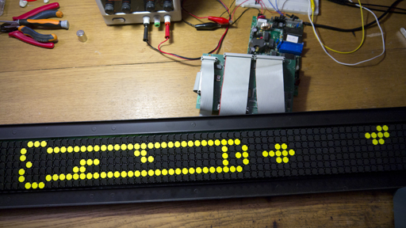

# HanoverFlipDot
Firmware disassembly of a Hanover Displays 84x7 flip-dot display

This display (unknown model code) doesn't use the pixel-by-pixel protocol described in other places. This one is greatly simplified and only allows to use a limited set of ASCII characters.

Drawing custom graphics would require a fontset hack:

## Protocol
RS-485 4800bps TX only, 8 data bits, odd parity, 1 stop bit.

The serial frame must start with two bytes: 0xFF, 0x41. The character count follows, then the ASCII characters with no termination (codes 0x20 to 0x5D are valid), and finally a checksum made of all the previous bytes except $FF XORed together.

For example, to write "ABCD", send:

`0xFF 0x41 0x04 0x41 0x42 0x43 0x44 0x41`

See comm.py for a simple helper.

## Fonts

The display automatically centers the text and chooses the largest font for a given message. If the message doesn't fit even in the smallest font, it is ignored and the display is cleared.

The fonts aren't monospaced :)

## Control board
The control board uses a Rockwell 6511Q, which is a 6502-based CPU with additionnal instructions and a few mcu-like peripherals.

Memory map:
* $0000~$001F: Peripherals registers
* $0040~$00FF: Internal RAM
* $2000~$2200: External RAM
* $E000~$FFFF: Program code

As with the original 6502, the reset vector is located at $FFFC, the IRQ vector at $FFFE.

See disasm.asm for the RAM map.
